# Content Hub

Product & News catalog with full-text search.
Built with **Golang**, **MySQL**, **RabbitMQ**, and **Elasticsearch** using **Clean Architecture**.

---

## Features

- Clean Architecture
- DTO Request Validation
- Swagger OpenAPI Documentation
- Full-text Search with Elasticsearch
- Fuzzy Search (Typo Tolerance)
- Recommendation Search System
- Outbox Pattern
- RabbitMQ Async Event Processing
- Graceful Shutdown
- Health Check Endpoint
- Pagination Meta Response
- Validation Error Formatter
- Structured Logging
- Request ID Middleware
- Recovery Middleware
- Dockerized Application
- GitHub Actions CI/CD
- DockerHub Auto Deploy

---

## Tech Stack

| Layer | Technology |
|-------|-----------|
| Language | Go 1.25.1 |
| HTTP Framework | Gin |
| Database | MySQL 8.0 + sqlx |
| Message Broker | RabbitMQ 3.x (amqp091-go) |
| Search Engine | Elasticsearch 8.x |
| API Documentation | Swagger / OpenAPI |
| Validation | go-playground/validator |
| Configuration | Viper |
| Logging | Zerolog |
| Dependency Injection | Manual Constructor Injection |
| Containerization | Docker + Docker Compose |
| CI/CD | GitHub Actions |
| Registry | DockerHub |

---

## Clean Architecture Layer

```txt
┌─────────────────────────────────────────────┐
│               Delivery Layer                │
│           internal/delivery/http            │
│                                             │
│  - Handler                                  │
│  - Middleware                               │
│  - Request DTO                              │
│  - Response Formatter                       │
└─────────────────────────────────────────────┘
                     ↓
┌─────────────────────────────────────────────┐
│               Usecase Layer                 │
│             internal/usecase                │
│                                             │
│  - Business Logic                           │
│  - Validation Flow                          │
│  - Recommendation Orchestration             │
└─────────────────────────────────────────────┘
                     ↓
┌─────────────────────────────────────────────┐
│              Repository Layer               │
│            internal/repository              │
│                                             │
│  - MySQL Repository                         │
│  - Elasticsearch Repository                 │
│  - RabbitMQ Publisher                       │
└─────────────────────────────────────────────┘
                     ↓
┌─────────────────────────────────────────────┐
│               Domain Layer                  │
│              internal/domain                │
│                                             │
│  - Entity                                   │
│  - Repository Interface                     │
│  - Usecase Interface                        │
└─────────────────────────────────────────────┘

         ↑ dependencies only point inward ↑
```

### Main Rules

- Each layer may only depend on the layer below it
- Domain layer must not import external packages (pure Go)
- Dependencies are injected through interfaces, not concrete structs
- Handlers must not directly access repositories
- Usecases only depend on repository interfaces

---

## Project Structure

```txt
content-hub/
│
├── .github/
│   └── workflows/
│       └── deploy.yml
│
├── cmd/
│   ├── api/
│   │   └── main.go
│   │
│   ├── consumer/
│   │   └── main.go
│   │
│   └── poller/
│       └── main.go
│
├── config/
│   └── config.go
│
├── docker/
│   └── mysql/
│       └── init/
│           └── init.sql
│
├── docs/
│   ├── docs.go
│   ├── swagger.json
│   └── swagger.yaml
│
├── internal/
│   │
│   ├── delivery/
│   │   └── http/
│   │       ├── router.go
│   │       │
│   │       ├── handler/
│   │       │   ├── health.go
│   │       │   ├── news.go
│   │       │   └── product.go
│   │       │
│   │       ├── middleware/
│   │       │   ├── logger.go
│   │       │   ├── recovery.go
│   │       │   └── request_id.go
│   │       │
│   │       ├── request/
│   │       │   ├── news.go
│   │       │   └── product.go
│   │       │
│   │       └── response/
│   │           ├── json.go
│   │           ├── response.go
│   │           └── search.go
│   │
│   ├── domain/
│   │   ├── entity/
│   │   │   ├── news.go
│   │   │   ├── outbox.go
│   │   │   └── product.go
│   │   │
│   │   ├── repository/
│   │   │   ├── news.go
│   │   │   ├── outbox.go
│   │   │   └── product.go
│   │   │
│   │   └── usecase/
│   │       ├── news.go
│   │       └── product.go
│   │
│   ├── helper/
│   │   ├── pagination.go
│   │   ├── string.go
│   │   └── validation.go
│   │
│   ├── infrastructure/
│   │   ├── elasticsearch/
│   │   │   └── client.go
│   │   │
│   │   ├── mysql/
│   │   │   └── db.go
│   │   │
│   │   └── rabbitmq/
│   │       ├── connection.go
│   │       ├── consumer.go
│   │       ├── publisher.go
│   │       ├── retry.go
│   │       └── topology.go
│   │
│   ├── logger/
│   │   └── logger.go
│   │
│   ├── outbox/
│   │   └── poller.go
│   │
│   ├── repository/
│   │   ├── elasticsearch/
│   │   │   ├── news.go
│   │   │   └── product.go
│   │   │
│   │   └── mysql/
│   │       ├── news.go
│   │       ├── outbox.go
│   │       └── product.go
│   │
│   └── usecase/
│       ├── news.go
│       └── product.go
│
├── postman/
│   └── content-hub.postman_collection.json
│
├── screenshoot/
│
├── .env
├── docker-compose.yml
├── Dockerfile
├── filebeat.yml
├── go.mod
├── go.sum
├── readme.md
├── structure.txt
└── todo.txt
```
---

## System Architecture

```txt
                    ┌──────────────┐
                    │    Client    │
                    └──────┬───────┘
                           │ HTTP
                           ▼
                 ┌──────────────────┐
                 │   Gin API Layer  │
                 └────────┬─────────┘
                          │
                          ▼
                 ┌──────────────────┐
                 │     Usecase      │
                 │  Business Logic  │
                 └────────┬─────────┘
                          │
            ┌─────────────┴─────────────┐
            ▼                           ▼
   ┌─────────────────┐         ┌─────────────────┐
   │      MySQL      │         │ Outbox Events   │
   └─────────────────┘         └────────┬────────┘
                                        │
                                        ▼
                              ┌─────────────────┐
                              │ Outbox Poller   │
                              └────────┬────────┘
                                       │
                                       ▼
                              ┌─────────────────┐
                              │    RabbitMQ     │
                              └────────┬────────┘
                                       │
                                       ▼
                              ┌─────────────────┐
                              │    Consumer     │
                              └────────┬────────┘
                                       │
                                       ▼
                              ┌─────────────────┐
                              │ Elasticsearch   │
                              └─────────────────┘
```

---

## Search Architecture

```txt
User Search Query
        │
        ▼
┌─────────────────────┐
│ Elasticsearch Query │
└──────────┬──────────┘
           │
           ▼
┌─────────────────────┐
│ Multi Match Search  │
│ - title^3           │
└──────────┬──────────┘
           │
           ▼
┌─────────────────────┐
│ Fuzziness AUTO      │
│ Typo Tolerance      │
└──────────┬──────────┘
           │
           ▼
┌─────────────────────┐
│ Search Result       │
└──────────┬──────────┘
           │
           ▼
┌─────────────────────┐
│ Recommendation      │
│ more_like_this      │
└─────────────────────┘
```

---

## Search Features

### Full-text Search

Uses Elasticsearch `multi_match` query.

### Fuzzy Search

Supports typo tolerance:

```txt
iphne   → iphone
androis → android
samsng  → samsung
```

Powered by:

```json
{
  "fuzziness": "AUTO"
}
```

### Recommendation Search

Uses Elasticsearch:

```txt
more_like_this
```

Recommendations are automatically generated from the first search result.

---

## API Endpoints

| Method | Path | Query Params | Description |
|--------|------|--------------|-----------|
| POST | /v1/products | — | Create product |
| GET | /v1/products | page, limit, category_id | Get product list |
| GET | /v1/products/search | q, page, limit, category_id | Search products |
| GET | /v1/products/:id | — | Get product detail |
| PUT | /v1/products/:id | — | Update product |
| DELETE | /v1/products/:id | — | Delete product |
| POST | /v1/news | — | Create news |
| GET | /v1/news | page, limit, category_id | Get news list |
| GET | /v1/news/search | q, page, limit, category_id | Search news |
| GET | /v1/news/:id | — | Get news detail |
| PUT | /v1/news/:id | — | Update news |
| DELETE | /v1/news/:id | — | Delete news |
| GET | /health | — | Health check |

---

## Swagger Documentation

Generate swagger docs:

```bash
swag init -g cmd/api/main.go
```

Open browser:

```txt
http://localhost:8080/v1/swagger/index.html
```

---

## Health Check

```bash
curl http://localhost:8080/health
```

Example response:

```json
{
  "success": true,
  "message": "service healthy",
  "data": {
    "status": "UP",
    "mysql": "UP",
    "elasticsearch": "UP",
    "rabbitmq": "UP"
  }
}
```

---

## Validation Error Format

```json
{
  "success": false,
  "message": "validation failed",
  "errors": {
    "title": "minimum length is 3",
    "price": "must be greater than 0"
  }
}
```

---

## Pagination Response Format

```json
{
  "success": true,
  "message": "products fetched successfully",
  "data": [],
  "meta": {
    "page": 1,
    "limit": 10,
    "total": 100,
    "total_pages": 10
  }
}
```

---

## Search Response Format

```json
{
  "success": true,
  "message": "products search fetched successfully",
  "data": {
    "items": [],
    "recommendations": []
  },
  "meta": {
    "page": 1,
    "limit": 10,
    "total": 100,
    "total_pages": 10
  }
}
```

---

## Setup & Run

### 1. Clone Repository

```bash
git clone https://github.com/reski-dev-id/content-hub-elastic-rabbitmq.git
cd content-hub-elastic-rabbitmq
```

---

### 2. Copy Environment

```bash
cp .env.example .env
```

---

### 3. Build Docker

```bash
docker compose build
```

---

### 4. Start All Services

```bash
docker compose up
```

Running services:

- MySQL
- RabbitMQ
- Elasticsearch
- API Server
- Outbox Poller
- RabbitMQ Consumer

---

## Docker Image

DockerHub:

```txt
programmerreski/content-hub
```

Pull latest image:

```bash
docker pull programmerreski/content-hub:latest
```

---

## CI/CD

Deployment flow:

```txt
feature/*
→ development
→ main
→ GitHub Actions
→ DockerHub auto push
```

When merged into `main`:

- GitHub Actions automatically builds Docker image
- Pushes image to DockerHub
- Generates latest image tag

GitHub Actions workflow:

```txt
.github/workflows/deploy.yml
```

---

## System Flow

```txt
Client Request
      ↓
API Server (Gin)
      ↓
MySQL + outbox_events
      ↓
Outbox Poller
      ↓
RabbitMQ
      ↓
Consumer
      ↓
Elasticsearch
```

---

## Verification

### List Products

```bash
curl http://localhost:8080/v1/products
```

---

### Create Product

```bash
curl -X POST http://localhost:8080/v1/products \
-H "Content-Type: application/json" \
-d '{
  "category_id": 1,
  "title": "iPhone 16",
  "slug": "iphone-16",
  "description": "Apple smartphone",
  "price": 25000000,
  "status": "active"
}'
```

---

### Create News

```bash
curl -X POST http://localhost:8080/v1/news \
-H "Content-Type: application/json" \
-d '{
  "category_id": 6,
  "title": "AI World",
  "slug": "ai-world",
  "content": "AI is rapidly evolving",
  "author": "Reski",
  "status": "published"
}'
```

---

### Search Product

```bash
curl "http://localhost:8080/v1/products/search?q=iphone&page=1&limit=10"
```

---

### Typo Search

```bash
curl "http://localhost:8080/v1/products/search?q=iphne"
```

---

## Applied Clean Architecture Principles

| Principle | Implementation |
|---------|-------------|
| Dependency Rule | All dependencies point inward — domain never imports infrastructure |
| Interface Segregation | Each repository and usecase has its own interface |
| Dependency Injection | Dependencies injected manually via constructors |
| Separation of Concern | Entity, business logic, data access, and delivery are fully separated |
| Testability | Usecases and handlers are easy to mock because they depend on interfaces |
| Single Responsibility | Each struct has a single clear responsibility |
| Graceful Shutdown | Server handles SIGTERM/SIGINT with proper cleanup |
| Async Processing | Outbox pattern + RabbitMQ for eventual consistency |

---

## Current Status

Current project capabilities:

- Production-ready backend foundation
- Async event-driven architecture
- Search indexing pipeline
- Standardized API response
- Docker-based deployment
- Automated CI/CD pipeline
- Health monitoring endpoint
- Swagger documentation
- Fuzzy typo-tolerant search
- Elasticsearch recommendation system
- Structured logging middleware
- Recovery middleware
- Request ID tracing


---

## Mermaid - Clean Architecture

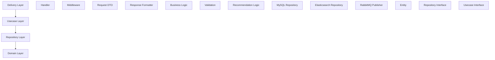

---

## Mermaid - System Architecture

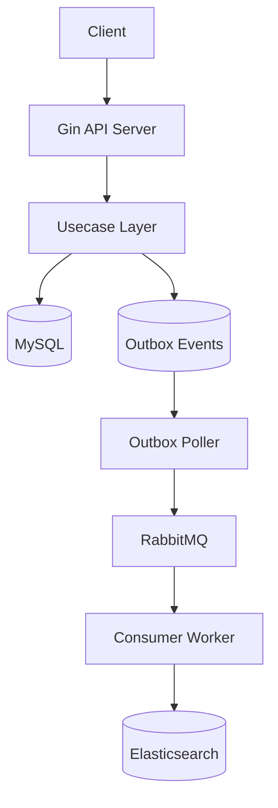

---

## Mermaid - Search Flow

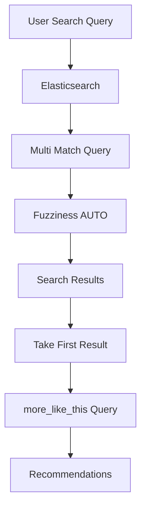

---

## Mermaid - Outbox Pattern

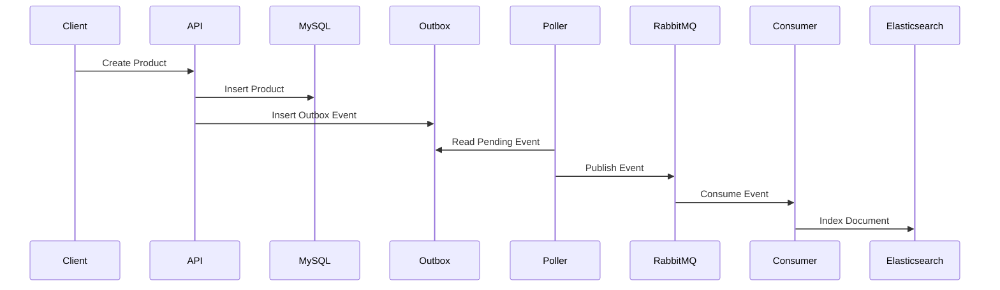

---

## Mermaid - Request Lifecycle

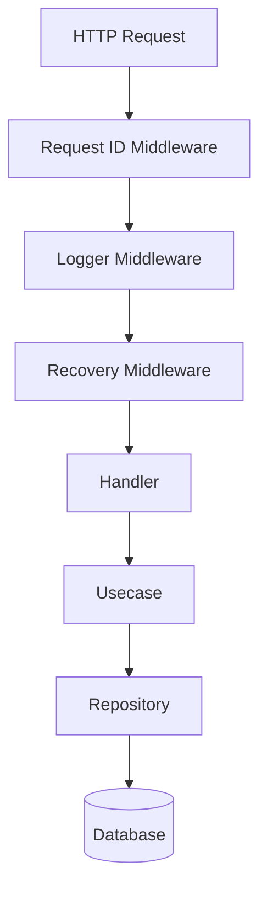

---

## Mermaid - RabbitMQ Topology

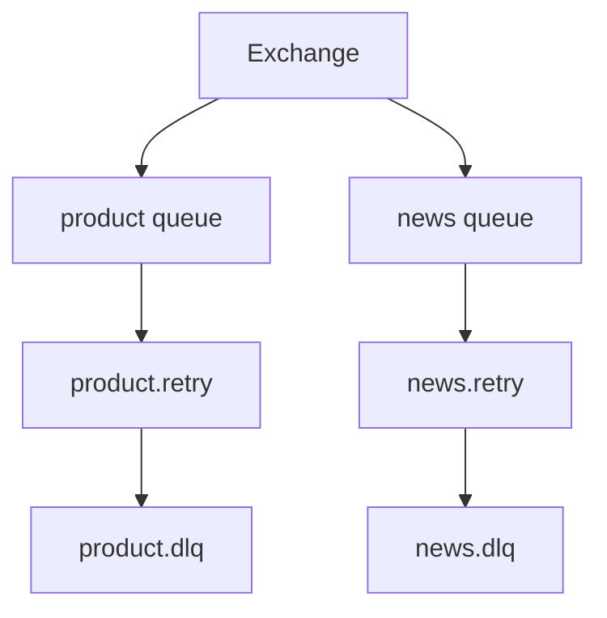

---

## Mermaid - Recommendation System

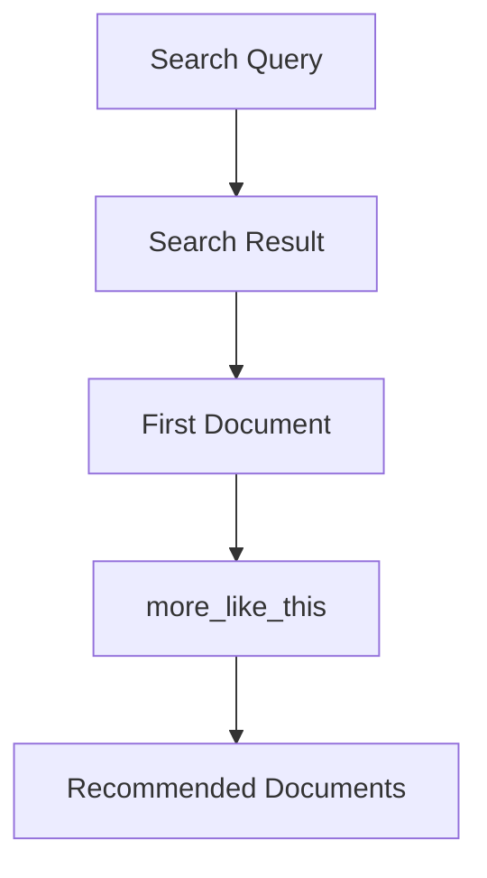

---

## Mermaid - Middleware Stack

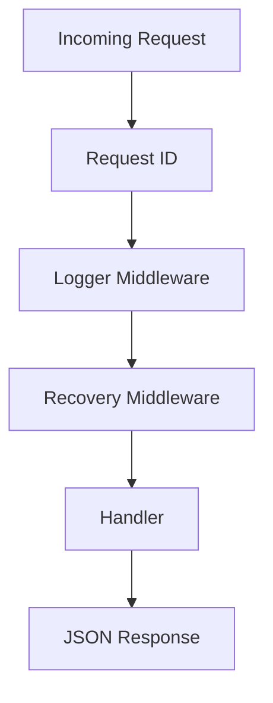

---

## Mermaid - Product Search Architecture

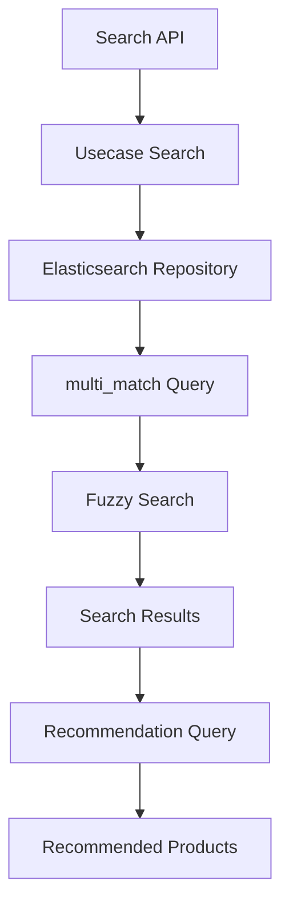

---

## Mermaid - Elasticsearch Recommendation

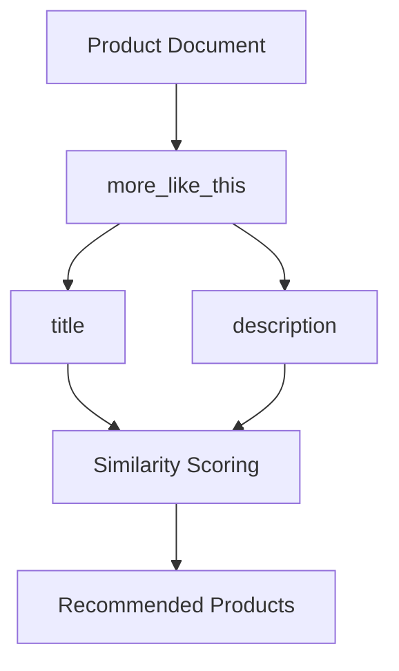

---

## Mermaid - Docker Services

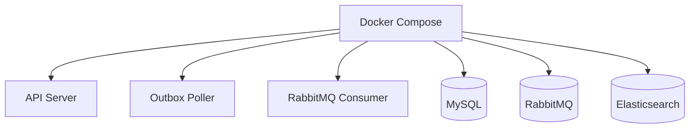

---

## Mermaid - CI/CD Pipeline

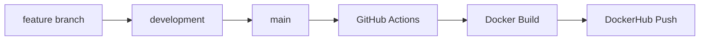

---

## Mermaid - Logging Pipeline

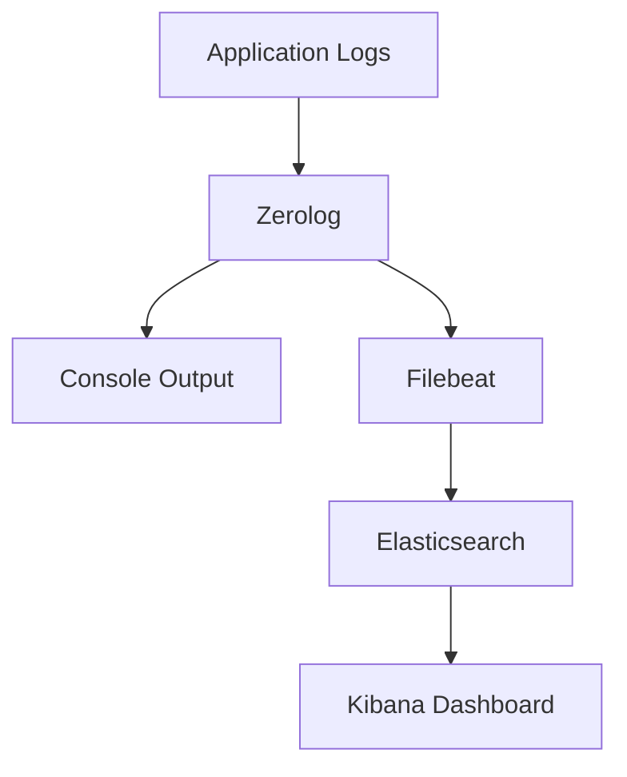

---

## Mermaid - Pagination Flow

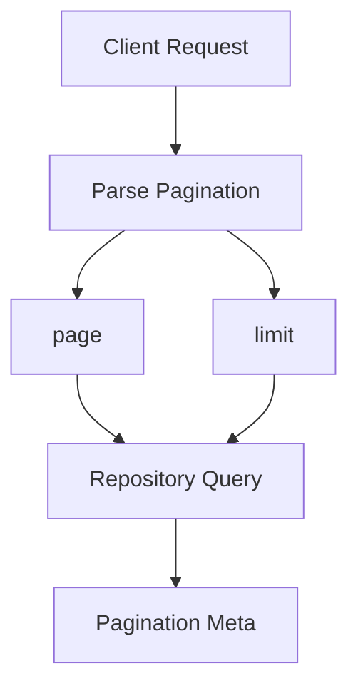

---

## Mermaid - API Response Structure

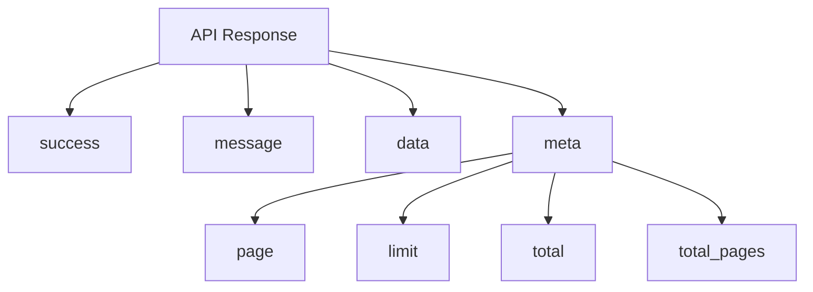

---

## Mermaid - Typo Tolerant Search

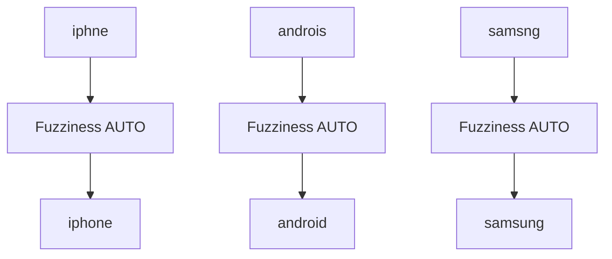

---

## Mermaid - Dependency Rule

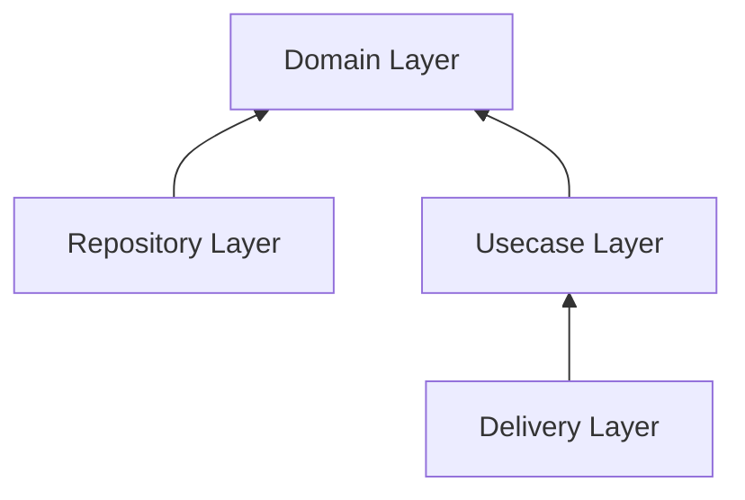

---

## Mermaid - Project Folder Responsibility

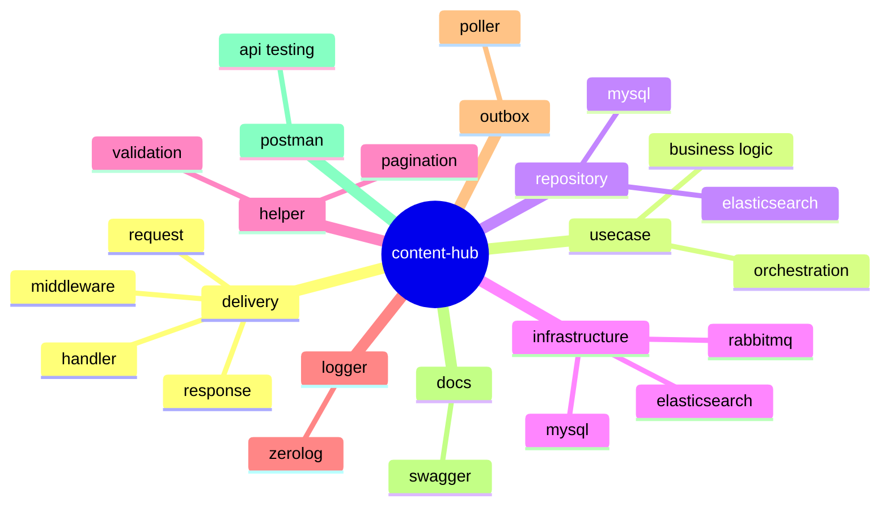

---

## Mermaid - Full Data Flow

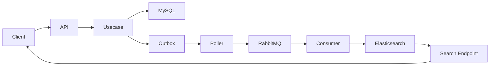

---

## Mermaid - Search Query Example

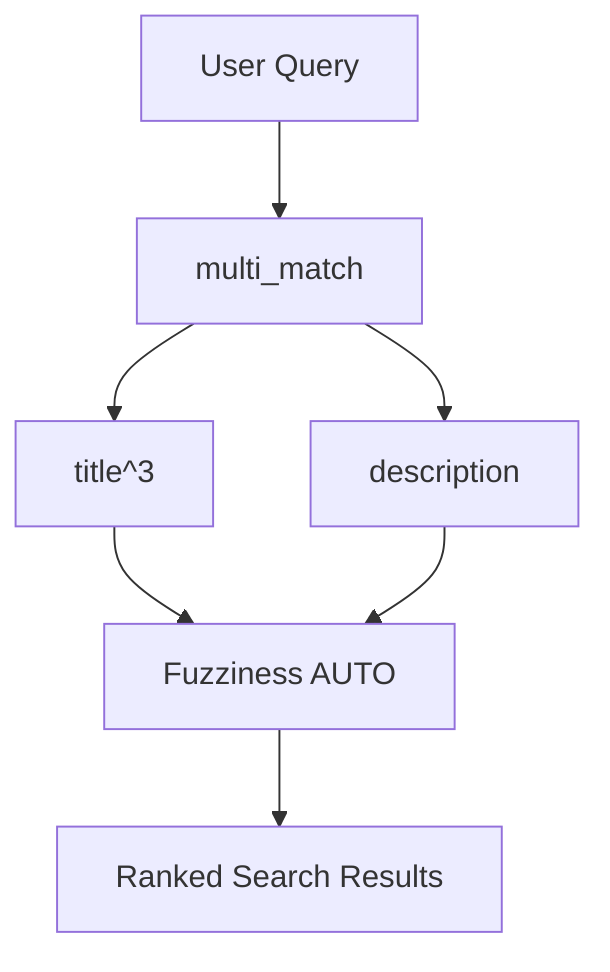

---

## Mermaid - Graceful Shutdown

```mermaid
flowchart TD

A[SIGINT / SIGTERM]
--> B[Stop HTTP Server]
--> C[Close RabbitMQ]
--> D[Close Database]
--> E[Shutdown Complete]
```

---

## Mermaid - Validation Flow

```mermaid
flowchart TD

A[Incoming JSON]
--> B[DTO Validation]

B --> C{Valid?}

C -->|No| D[Validation Error Response]

C -->|Yes| E[Continue to Usecase]
```

---

## Mermaid - Structured Logging Example

```mermaid
flowchart TD

A[HTTP Request]
--> B[Request ID]

B --> C[Zerolog Fields]

C --> D[service]
C --> E[event]
C --> F[duration_ms]
C --> G[status_code]

D --> H[JSON Log Output]
E --> H
F --> H
G --> H
```